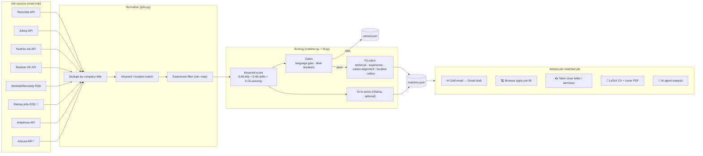
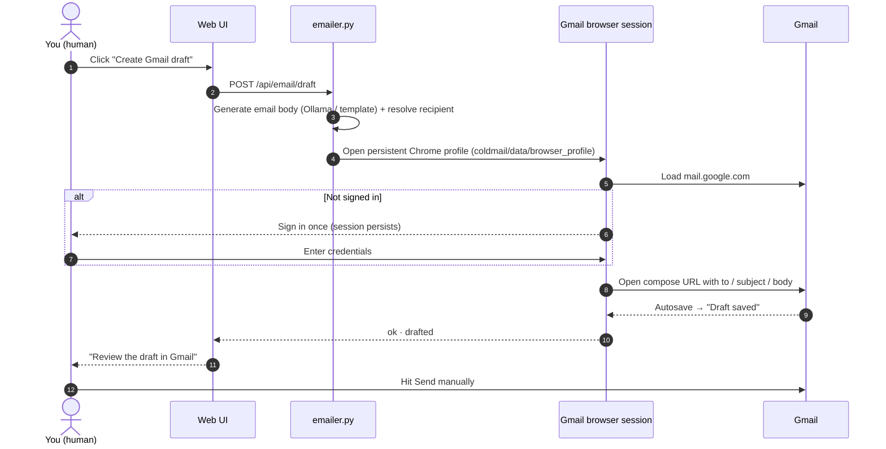
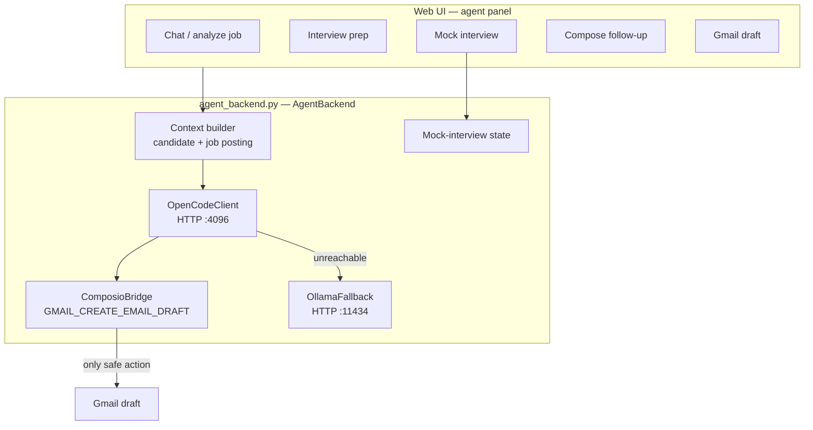
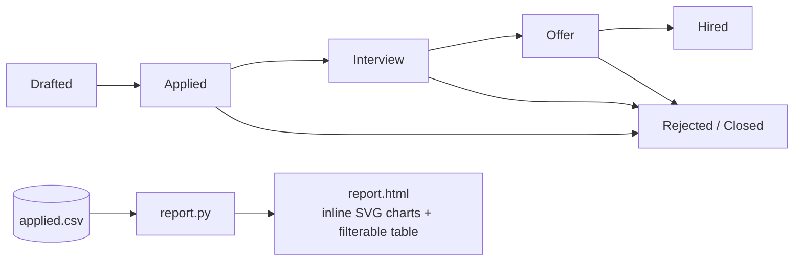
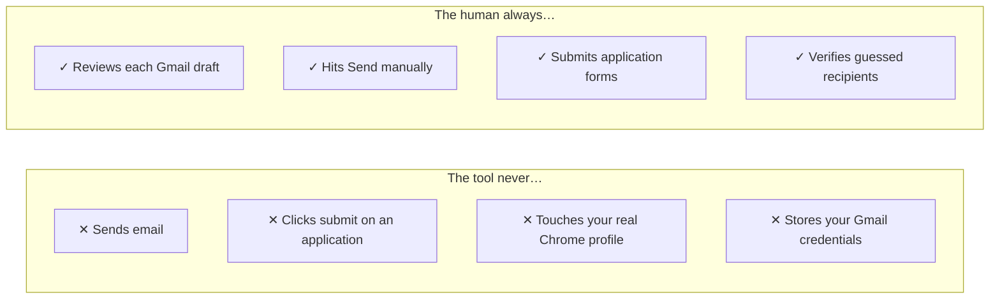

# j0b — job searcher + autoapply (single program)

One local web app that merges the three tools that used to live in
`autoapply/`, `coldmail/` and `webui/` into a single program.

| Capability | What it does | Safety model |
|------------|--------------|--------------|
| **Job search** | Fetches jobs from free/legal APIs (Remotive, Jobicy, freehire.me, optional Adzuna) | Read-only |
| **Flexible filters** | **Role / keywords**, **years of experience (min–max)**, **location**, **salary (min–max)**, startup-only, per-source toggles | — |
| **Matching** | Scores jobs vs your resume + profile (experience / location / salary fit, language gate, deal-breakers, 5-dimension rubric) | Offline |
| **Gmail autoapply** | Generates a polite cold application email for a matched job and saves it as a **Gmail DRAFT** in a real browser session | **Drafts only — never sends.** You review & hit send |
| **Browser apply** | Opens the job page pre-filled from your profile so you review and submit yourself | Semi-auto — never clicks submit |
| **Tailoring / CV** | Per-job cover letter + resume summary (Ollama or template), optional LaTeX CV + cover PDFs | — |
| **AI agent** | opencode brain + Composio tools: summarize/score jobs, interview prep, mock interview, Gmail draft | Drafts only |
| **Tracker** | Logs every application/draft; self-contained HTML dashboard + funnel stats | Local CSV |

---

## Architecture

### High-level system overview

```mermaid
flowchart TB
    subgraph UI["Web UI (Flask) — app.py"]
        TEMP[templates/ · index.html]
        STAT[static/ · app.js + style.css]
        API["/api/* endpoints"]
    end

    subgraph AUTO["autoapply library"]
        JOBS[autoapply/jobs.py]
        FILT[autoapply/filters.py]
        FIT[autoapply/fit.py]
        MATCH[autoapply/matcher.py]
        RES[autoapply/resume.py]
        TAIL[autoapply/tailor.py]
        CV[autoapply/cv.py]
        APPLY[autoapply/apply_agent.py]
        REP[autoapply/report.py]
        CFG1[autoapply/config.py]
    end

    subgraph COLD["coldmail library"]
        WRI[coldmail/writer.py]
        RESV[coldmail/resolver.py]
        DIS[coldmail/discovery.py]
        GMAIL[coldmail/gmail_drafter.py]
    end

    subgraph WEBUI["webui library"]
        AGENT[agent_backend.py]
        OC["opencode server :4096"]
        COM["Composio (Gmail OAuth)"]
        OLL["Ollama :11434"]
    end

    subgraph DATA["autoapply/data + coldmail/data"]
        JOBS_JSON[(jobs.json)]
        MATCHES_JSON[(matches.json)]
        VETOED_JSON[(vetoed.json)]
        APPLIED_CSV[(applied.csv)]
        REPORT_HTML[(report.html)]
        STARTUPS_CSV[(startups.csv)]
        DRAFTS[(drafts/*.txt)]
        PROFILE[(browser_profile/)]
        TAILORED[(tailored/*.txt)]
        CV_DIR[(cv/*.tex · *.pdf)]
    end

    UI --> API
    API --> JOBS
    API --> FILT
    API --> MATCH
    API --> TAIL
    API --> CV
    API --> APPLY
    API --> REP

    API --> EMAILER["emailer.py"]
    EMAILER --> WRI
    EMAILER --> GMAIL
    API --> AGENT

    JOBS --> JOBS_JSON
    MATCH --> MATCHES_JSON
    MATCH --> VETOED_JSON
    APPLY --> APPLIED_CSV
    REP --> APPLIED_CSV
    REP --> REPORT_HTML
    DIS --> STARTUPS_CSV
    WRI --> DRAFTS
    GMAIL --> PROFILE
    TAIL --> TAILORED
    CV --> CV_DIR

    AGENT --> OC
    AGENT --> COM
    AGENT --> OLL
    TAIL --> OLL
    CV --> OLL
    RES --> RESUMEPDF[(resume.pdf)]
```



### Job pipeline — from feeds to ranked matches



### Gmail draft flow (drafts only — never sends)



### AI agent backend (opencode + Composio + Ollama fallback)



### Application tracking funnel



---

## Repository layout

```
j0b/
├── app.py                  # Flask web app — drives everything (all /api routes)
├── emailer.py              # bridge: coldmail writer + Gmail draft + recipient resolve
├── config.yaml             # single source of truth for all configuration
├── requirements.txt
│
├── autoapply/              # job search + filters + matching + tailoring + apply
│   ├── cli.py              # terminal CLI: search / match / tailor / apply / cv / report
│   └── autoapply/
│       ├── jobs.py         # fetch + normalize + dedupe from Remotive/Jobicy/freehire/Adzuna
│       ├── filters.py      # salary & experience-range parsers, startup detection
│       ├── fit.py          # 5-dimension fit rubric + language gate + deal-breakers
│       ├── matcher.py      # keyword/AI scoring → matches.json, vetoed.json
│       ├── resume.py       # PDF/DOCX/TXT parsing + skill extraction
│       ├── tailor.py       # per-job cover letter + resume summary (Ollama/template)
│       ├── cv.py           # LaTeX moderncv CV + cover letter → PDF (lualatex/xelatex/pdflatex)
│       ├── apply_agent.py  # semi-auto browser apply (pre-fill, YOU submit) + applied.csv log
│       ├── report.py       # self-contained HTML dashboard + funnel stats
│       └── config.py       # YAML load/save helpers
│
├── coldmail/               # cold-application emails → Gmail drafts only
│   ├── cli.py              # terminal CLI: discover / resolve / drafts / gmail login|draft
│   └── coldmail/
│       ├── discovery.py    # find startups hiring from job feeds → startups.csv
│       ├── resolver.py     # best-effort contact-email resolution (mailto → contact pages → guess)
│       ├── writer.py       # polite+frank email generation (Ollama/template) + subject
│       └── gmail_drafter.py# persistent-browser Gmail draft creation (NEVER sends)
│
├── webui/                  # AI agent backend
│   └── agent_backend.py    # AgentBackend: opencode brain + Composio tools + Ollama fallback
│
├── templates/index.html    # single-page web UI
├── static/app.js           # frontend logic
├── static/style.css
│
├── tests/                  # offline + browser smoke tests
│
├── jobfree.txt             # research: how commercial auto-apply tools work
└── job.txt                 # sample of 100 startup jobs for filter testing
```

---

## Quick start

```bash
pip install -r requirements.txt
python -m playwright install chromium     # for Gmail drafts + browser apply
cp config.example.yaml config.yaml        # your real config is git-ignored
# ... edit config.yaml with your profile (name, email, skills, salary)
python app.py                              # -> http://127.0.0.1:5000
```

Then, in the web app:

1. **Profile** — fill name/email/roles/years/salary/locations, upload your
   resume (skills are auto-detected).
2. **Filters** — set role keywords, **experience min/max**, location, salary
   min/max, startup-only, sources → **Search jobs**.
3. **Score vs resume** — rank the results, then per job:
   - **✉ Cold email** → generates an application email (and a best-effort
     recipient) → click **Login to Gmail (once)** the first time, then
     **Create Gmail draft (browser)**. Review the draft in Gmail and send it
     yourself. Drafts only — nothing is sent automatically.
   - **💻 Apply** → opens the job page pre-filled from your profile; you
     review and submit yourself.
   - **✍ Tailor** → cover letter + resume summary (and LaTeX CV PDFs if you
     have TeX installed).
4. Log outcomes (applied / interview / offer / hired / skipped / rejected)
   and generate the **HTML tracker report**.

### Gmail drafts (cold-application emails)

- The **first time** you click **📤 Create Gmail draft (browser)**, a Chrome
  window opens and asks you to sign in with your Gmail account (the account
  in `config.yaml` → `sender.email`). Sign in once — the session persists in
  the isolated profile `coldmail/data/browser_profile` (your real Chrome
  profile is never used or touched). The draft is then created from that
  account.
- Alternatively use **🔑 Login to Gmail (once)** to sign in ahead of time.
- **Drafts only**: the tool creates drafts, never sends. Always review in
  Gmail before hitting Send yourself.

### AI agent panel

The agent talks to an opencode server (HTTP API, default
`http://127.0.0.1:4096`; started automatically if missing). It can also
create a Gmail draft via **Composio**:

```bash
pip install composio
composio add gmail              # one-time OAuth connect (or the UI button)
export COMPOSIO_API_KEY=your_key
```

Without Composio the agent still works for analysis + email writing
(falls back to your local Ollama model).

---

## Automated daily drafting (`auto_send.py` + `.bat`)

This is the one fully-automated path: every day it fetches fresh jobs, scores
them against your profile, resolves each company's contact email, writes a
personalized application email, and **saves it as a Gmail draft** (resume PDF
attached). **Nothing is ever sent** — every draft lands in your Gmail Drafts
folder and you hit Send yourself. A ledger ensures the same person/company is
never drafted to twice.

### One-time setup (5 minutes, once)

1. **Google Cloud console** → https://console.cloud.google.com → create a
   project (e.g. `j0b`) → *APIs & Services* → *Library* → enable **Gmail API**.
2. *APIs & Services* → *OAuth consent screen* → External → add yourself as a
   test user → click **Publish app** (in Testing mode the token expires after
   7 days; publishing keeps it valid).
3. *Credentials* → *Create credentials* → **OAuth client ID** → type
   **Desktop app** → download the JSON and save it in the project root as
   `client_secret.json` (gitignored).
4. Authorize once (opens your browser, click Allow):

   ```bash
   pip install -r requirements.txt
   python gmail_setup.py
   ```

   → `token.json` is saved (gitignored). Every later run reuses it silently —
   no browser, no stored password.

### Run it

```bash
run_daily_dry.bat          # preview today's plan (creates nothing)
run_daily.bat              # actually create today's drafts
install_scheduler.bat      # schedule it daily at 09:00 via Task Scheduler
install_scheduler.bat 07:30
install_scheduler.bat uninstall
```

The only Gmail action the code ever performs is `users.drafts.create` — there
is no send call anywhere. Drafts you don't like are trivially discarded in
Gmail; the ledger only counts drafts that were actually saved.

### How it decides who to draft to (dedup criteria)

Every run builds a plan and skips anything that fails these checks, so no one
is ever contacted twice:

| Check | Rule |
|-------|------|
| **Recipient history** | recipient address already in `data/sent_emails.csv` (status `drafted`) → skip forever |
| **Recipient in-run** | same address resolved for two postings in one run → keep only the first |
| **Company in-run** | two postings from the same company in one run → keep only the first |
| **Company cooldown** | company drafted within `send.company_cooldown_days` (45) → skip |
| **Already applied** | company in `autoapply/data/applied.csv` with status `applied` → skip |
| **Vetoed** | company in `autoapply/data/vetoed.json` (language gate / deal-breakers) → skip |
| **Score** | `match_score` below `send.min_score` (40) → skip |
| **No recipient** | no email found on the company site → skip (or `hello@domain` guess, if `send.allow_guessed_recipients` is on) |

Every attempt (drafted / error) is recorded in `data/sent_emails.csv`; each
run's log appends to `data/auto_send.log`.

### Tuning (`config.yaml` → `send`)

- `mode` — `gmail_api` (default: save drafts, never send) or `off` (plan only).
- `max_emails_per_run` — daily cap (default 100; the free feeds typically
  supply ~20–60 matching postings/day anyway).
- `min_score` — only draft matches scoring at least this (default 40).
- `delay_between_seconds` — pause between drafts (default 2).
- `allow_guessed_recipients` — `hello@domain` guesses (verify them in Gmail
  before sending, since some may not exist).
- `email_engine` — how the email text is written:
  - `opencode` (default): the free opencode agent writes subject + body from
    your resume text + the JD. The agent runs with **zero tools and no
    permissions** — it can only return text (it cannot send, create, or read
    anything), and no API keys are ever passed to it. ~30–60 s per new
    company (cached per company, so repeats are instant). Falls back to the
    template if opencode is unreachable.
  - `ollama` — local Ollama writes the body (~1–2 min each).
  - `template` — fast offline template (names you, weaves in the role,
    company, and matching JD keywords).
- `personalize_with_ai` — legacy flag; `true` maps to `email_engine: ollama`.
- `company_cooldown_days` — re-contact window per company (default 45).
- Credentials: `client_secret.json` (you download it) + `token.json`
  (auto-created by `gmail_setup.py`).

---

## CLI usage

The merged web app is the primary interface, but each library keeps its own
terminal CLI for scripted / headless use.

### autoapply (`autoapply/cli.py`)

```bash
python autoapply/cli.py search --keywords "python, ai" --limit 40
python autoapply/cli.py match                         # score vs resume
python autoapply/cli.py tailor --top 10               # per-job docs
python autoapply/cli.py apply --job-id 3              # semi-auto apply
python autoapply/cli.py cv --job-id 3                 # LaTeX CV + cover PDF
python autoapply/cli.py report --open                 # HTML dashboard
python autoapply/cli.py status                        # application log
```

### coldmail (`coldmail/cli.py`)

```bash
python coldmail/cli.py discover --keywords "python, ai" --max-companies 10
python coldmail/cli.py resolve
python coldmail/cli.py drafts --dry-run
python coldmail/cli.py gmail login
python coldmail/cli.py gmail draft --limit 5
```

---

## Configuration

Everything lives in **one file**: `config.yaml` at the project root.

| Section | Purpose |
|---------|---------|
| `candidate` | Your profile (name, roles, years of experience, salary range, locations, languages, deal-breakers, STAR examples) |
| `search` | `keywords`, `locations`, `limit`, `exp_min`, `exp_max` |
| `sources` | enable/disable Remotive / Jobicy / freehire (facets) / Remote OK / WeWorkRemotely / Startup.jobs (startups) / Arbeitnow / Adzuna |
| `match` | scoring mode (`keywords` / `ai`) and `min_score` threshold |
| `sender` + `outreach` | who the cold emails come from and the ask/signoff |
| `ollama` | local LLM base URL + model for tailoring / email / CV writing |
| `agent` | opencode server config + Composio key/apps + fallback model |
| `apply` | browser page-load timeout for the semi-auto apply |

---

## Safety model

j0b is designed so a human always makes the final call:



- The only outbound action the agent backend can perform is
  `GMAIL_CREATE_EMAIL_DRAFT` (Composio).
- Recipients flagged as "guessed" (`hello@domain`) are pattern guesses —
  verify them before sending.

## Personal data & git — what is git-ignored

Your personal profile lives in `config.yaml` (name, email, phone, LinkedIn,
salary expectations, resume path) and the email/recipient ledger lives in
`data/`. **None of it is committed** — it is all git-ignored:

| Path | Why it is ignored |
|------|-------------------|
| `config.yaml` + `autoapply/config.yaml` + `coldmail/config.yaml` | Your full personal profile (name, email, phone, LinkedIn, salary, resume path) |
| `data/` (incl. `autoapply/data/`, `coldmail/data/`) | `sent_emails.csv` recipient ledger, `auto_send.log`, email caches, `drafts/`, tailored docs |
| `coldmail/data/browser_profile/` | Your **real Gmail login session** — never commit, zip, or share it |
| `client_secret.json`, `token.json`, `credentials.json` | Gmail API OAuth credentials |
| `*.env` / `secrets.env` | Any environment secrets (e.g. `GMAIL_APP_PASSWORD`) |

`config.example.yaml` is a **sanitized template** with placeholder values —
the only config file in the repo. To start on a fresh machine:

```bash
cp config.example.yaml config.yaml   # then fill in YOUR details
```

Never commit `config.yaml` — if you ever see it in `git status`, it has
slipped out of the ignore rules; add it back before committing.

## Security notes

- The tool never sends email and never submits applications on its own.
- Recipients flagged as "guessed" (`hello@domain`) are pattern guesses —
  verify them before sending.

## Tests

```bash
# offline: exp filter, cold-email pipeline, auto-send dedup, fit framework, report, LaTeX sources, agent backend
python tests/test_filters.py
python tests/test_emailer.py
python tests/test_auto_send.py
python tests/test_ai_email.py
cd autoapply && python tests/test_fit.py && python tests/test_report.py && python tests/test_cv.py
cd webui && python tests/test_agent.py

# browser smoke tests (server must be running on :5000)
python tests/test_ui.py
```

## Research

`jobfree.txt` — deep dive on how the commercial auto-apply tools
(LazyApply, LoopCV, Jobright, Simplify, FastApply, AIApply) work and the
open-source components they are built from. `job.txt` — a sample of 100
startup jobs (Cutshort, India) for testing the filters.
